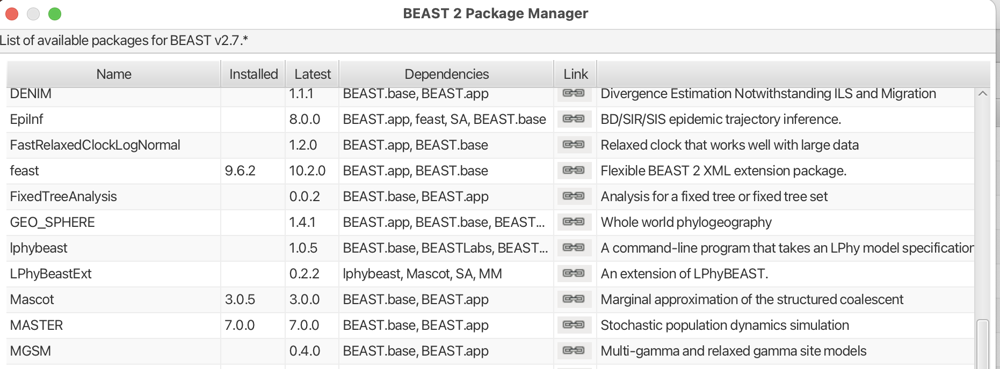

# Background

The structured coalescent models how lineages coalesce within and migrate between sub-populations using coalescent and migration rates, which can be related to epidemiologically more meaningful parameters, such as the prevalence and transmission rates . Structured coalescent methods largely assume that the rates of coalescence and migration are constant over time, though deterministic approaches to model parametric dynamics from compartmental models exist . 
Here, we learn to use a phylodynamic framework to infer non-parametric effective population size (Ne) dynamics under the marginal approximation of the structured coalescent (MASCOT). 
We will do so using a subset of the ZIKA virus analyses from . Instead of using the full dataset, which would take too long to run in this tutorial, we use 49 sequences from the Northeast of Brazil or the Caribbean.

We will estimate effective population sizes at predefined points in time . 
To model the temporal correlation between effective population sizes, we will use a Gaussian Markov Random Field (GMRF), as in. 
We will then estimate Ne trajectories for the Northeast of Brazil and the Carribean. 

----

# Programs used in this Exercise

### BEAST2 - Bayesian Evolutionary Analysis Sampling Trees 2

BEAST2 ([http://www.beast2.org](http://www.beast2.org)) is a free software package for Bayesian evolutionary analysis of molecular sequences using MCMC and strictly oriented toward inference using rooted, time-measured phylogenetic trees. This tutorial is written for BEAST v{{ page.beastversion }} .

### BEAUti2 - Bayesian Evolutionary Analysis Utility

BEAUti2 is a graphical user interface tool for generating BEAST2 XML configuration files.

Both BEAST2 and BEAUti2 are Java programs, which means that the same code runs on all platforms. For us, it simply means that the interface will be the same on all platforms. The screenshots used in this tutorial are taken on a Mac OS X computer; however, both programs will have the same layout and functionality on both Windows and Linux. BEAUti2 is provided as a part of the BEAST2 package so you do not need to install it separately.

### TreeAnnotator

TreeAnnotator is used to summarise the posterior sample of trees to produce a maximum clade credibility tree. It can also be used to summarise and visualize the posterior estimates of other tree parameters (e.g. node height).

TreeAnnotator is provided as a part of the BEAST2 package so you do not need to install it separately.

### Tracer

Tracer ([http://tree.bio.ed.ac.uk/software/tracer](http://tree.bio.ed.ac.uk/software/tracer)) is used to summarise the posterior estimates of the various parameters sampled by the Markov Chain. This program can be used for visual inspection and to assess convergence. It helps to quickly view median estimates and 95% highest posterior density intervals of the parameters, and calculates the effective sample sizes (ESS) of parameters. It can also be used to investigate potential parameter correlations. We will be using Tracer v{{ page.tracerversion }}.

### IcyTree.org

IcyTree.org is a web-based tree viewer that, in addition to trees, also allows the user to visualize trees without needing a standalone program .

----

# Practical: Parameter and State inference using the approximate structured coalescent

In this tutorial, we will estimate migration rates, nonparametric (skygrid) population sizes and the locations of internal nodes using the marginal approximation of the structured coalescent implemented in BEAST2, MASCOT .

The aim is to:

-  Learn how to set up a MASCOT-Skyline analysis
-  Learn how to infer structure from trees with sampling location
-  Learn how to estimate time-varying effective population sizes and migration rates
-  Get to know how to choose the set-up of such an analysis
-  Learn how to read the output of a MASCOT-Skyline analysis

## Setting up an analysis in BEAUti

### Download MASCOT

First, we have to download the package MASCOT (we need at least version 3.0.5) using the BEAUTi package manager. Go to _File >> Manage Packages_ and download the package MASCOT.

<figure>
	
	
	<figcaption>Figure 1: Download the MASCOT package.</figcaption>
</figure>  

MASCOT will only be available in BEAUti once you close and restart the program.

### Loading the Influenza A/H3N2 Sequences (Partitions)

The sequence alignment is in the file [sequences.nexus](https://raw.githubusercontent.com/nicfel/MascotSkyline-Tutorial/main/data/sequences.fasta).
Right-click on this link and save it to a folder on your computer.
Once downloaded, this file can either be drag-and-dropped into BEAUti or added by using BEAUti's menu system via _File >> Import Alignment_.
Once the sequences are added, we need to specify the sampling dates and locations.

### Get the sampling times (Tip Dates)

Open the "Tip Dates" panel and then select the "Use tip dates" checkbox.

The sampling times are encoded in the sequence names.  We can tell BEAUti to use these by clicking the _Auto-configure_ button. The sampling times are in the isolate name after the last vertical bar "|" in the sequence name. To extract these times, select "use everything", select "after last" and enter "|" (without the quotes) in the text box immediately to the right. The setup should look as shown in the figure below.

<figure>
	
	
	<figcaption>Figure 2: Guess sampling times.</figcaption>
</figure>  

Clicking "OK" should now populate the table with the sample times extracted from the sequence names: the column **Date** should now have values between 2016 and 2015 and the column **Height** should have values from 0 to 2. The heights denote the time difference from a sequence to the most recently sampled sequence. If everything is specified correctly, the sequence with Height 0.0 should have a date of 2016.77.

### Specify the Site Model (Site Model)

Next, we have to specify the site model. To do this, choose the "Site Model" tab. We will use an HKY+Gamma_4 model. This model allows for differences in transversion and transition rates, meaning that changes between bases that are chemically more closely related (transitions) are allowed to have a different rate to changes between bases that are chemically more distinct (transversions).
Additionally, we should allow for different rate categories for different sires in the alignment.
This can be done by setting the _Gamma Category Count_ to 4, which is just a value that has typically been used. Make sure that the estimate is checked next to the shape parameter. To reduce the number of parameters we have to estimate, we can set Frequencies to Empirical.

<figure>
	
	
	<figcaption>Figure 3: Set the site model.</figcaption>
</figure>  

### Set the clock model (Clock Model)

For rapidly evolving viruses, the assumption of a strict molecular clock is often made, meaning that the molecular clock is the same on each branch of the phylogeny. We will leave everything to the default here

### Specify the priors (Priors)

We first have to choose the tree prior, which in this case is MASCOT.
To do so, search the drop-down menu next to `Tree.t:sequences` and choose MASCOT.
To see more options, we have to expand the MASCOT tree prior by clicking the arrow to the left of the label.
By default, the rate dynamics for this setting are `Constant`, which means that effective population sizes and migration rates are assumed to be constant through time.
To use skyline dynamics, we have to choose `Skyline` from the drop-down menu next to `Dynamics`.

<figure>
	
	
	<figcaption>Figure 4: Setting the MASCOT dynamics to Skyline.</figcaption>
</figure>  

We next have to define the sampling location of the individual tips. Initially, the column **Location** should be NOT_SET for every sequence. After clicking the _Guess_ button, you can split the sequence on the vertical bar "|" again by selecting "split on character" and entering "|" in the box. However, the locations are in the fourth group, so this time choose "4" from the drop-down menu. After clicking the _OK_ button, the window should look like the one shown in the figure below:

<figure>
	
	
	<figcaption>Figure 5: Configuring sample locations.</figcaption>
</figure>  

When leaving the priors tab and then returning to it, there will be an option to choose the population dynamics of each state separately.
Leaving the priors tab is currently necessary to make the option appear (as it forces the tab to reload), but will hopefully not be necessary in the future.

<figure>
	
	
	<figcaption>Figure 6: Set the Ne dynamics in both locations to Skyline dynamics.</figcaption>
</figure>  

We next set the dynamics of both locations `Brazil_Northeast` and `Caribbean` to Skyline dynamics.
To the right of the skyline dynamics, we can set the number of Ne's to be estimated to 5.
This means that for each location, we will estimate 5 different effective population sizes that are equally spaced in time between the most recent sample and the root of the tree. The effective population size is estimated at five points in time. Between those five points, the effective population size is assumed to change through exponential growth.

<figure>
	
	
	<figcaption>Figure 7: Description of the parameterization of the skyline model. In this case, 4 Ne's are estimated. Between the points where the Ne's are estimated, MASCOT-Skyline assumes exponential growth.</figcaption>
</figure>  

Now, we need to set the priors for the effective population sizes. We here consider non-parametric population size dynamics. This means that we do not have a parametric function guiding the change in the effective population sizes over time (such as exponential growth). This allows us to describe relatively arbitrary dynamics in the effective population sizes over time. However, we still know that the Ne at time t+1 is dependent on the Ne at time t. In other words, the current size of the population can't be too far away from the past population size. 

To input this knowledge into the model, we use what is sometimes referred to as a "smoothing prior" on the effective population sizes. Here, we want to use Gaussian Markov Random Field (GMRF) prior. The GMRF prior assumes that the effective population size of the log(Ne(t+1)) is a random draw from a normal distribution around with mean log(Ne(t)) and standard deviation sigma. The GMRF prior here is used to model temporal autocorrelation.

To set the GMRF prior, we have to put a prior distribution on the difference between the log effective population sizes, here described by `diff.SkylineNe.Brazil_Northeast` and `diff.SkylineNe.Caribbean`. To do so, we can click on the field to the right of `SkylineNe.Brazil_Northeast` and `diff.SkylineNe.Caribbean` and choose a Normal Distribution

<figure>
	
	
	<figcaption>Figure 8: Set up Gaussian Markov Random Field (GMRF) prior/smoothing prior on the effective population sizes.</figcaption>
</figure>  

Lastly, we can also put a prior on what we think the most recent value for the logNe value was for both locations. To do so, we can click on the field to the right of `first.SkylineNe.Brazil_Northeast` and `first.SkylineNe.Caribbean` and choose a Normal Distribution. We can then set the mean to 0 and the standard deviation to 1. This means that we assume that the most recent value for the logNe is 0 with a standard deviation of 1. This is a relatively uninformative prior, meaning that we don't have much information about the most recent value for the logNe. We can change the values for the mean and standard deviation if we want to make it more or less informative

### Specify the MCMC chain length (MCMC)

Now switch to the "MCMC" tab. Here we can set the length of the MCMC chain and decide how frequently the parameter and trees are logged. For this dataset, 2 million iterations should be sufficient. Next, we have to save the `*.xml` file using _File >> Save
as_.

<figure>
	
	
	<figcaption>Figure 9: save the \*.xml.</figcaption>
</figure>

### Run the Analysis using BEAST2

Run the `*.xml` using BEAST2 or use finished runs from the *precooked-runs* folder. 

### Analyse the log file using Tracer

First, we can open the `*.log` file in tracer to check if the MCMC has converged. The ESS values are ideally all above 200 for almost all values and especially for the posterior estimates.

<figure>
	
	
	<figcaption>Figure 10: Check if the posterior converged.</figcaption>
</figure>  

Next, we can check the trends for the effective population size over time for both locations. To do so, go to the end of the log file, and select all values starting with `SkylineNe` and go to the `Estimates` panel.

<figure>
	
	
	<figcaption>Figure 11: Compare the trends in the effective population sizes for the Northeast of Brazil and the Caribbean.</figcaption>
</figure>  

The first value, e.g., `SkylineNe.Brazil_Northeast.1` denotes the log effective population size of the Northeast of Brazil at the time of the most recent sample, while the last value, here `SkylineNe.Brazil_Northeast.5` denotes the effective population size of the Northeast of Brazil at the time of the root of the tree. The values between, e.g. `SkylineNe.Brazil_Northeast.3` are spaced equally in time between the most recent sample and the root of the tree. The values are in log space, meaning that we have to exponentiate them to get the actual effective population sizes. We can see for both locations the Ne to be higher more recently, indicating that the Ne grew from the time of the root to the time of the most recent common ancestor.

Next, we can have a look at the inferred migration rates. The migration rates are denoted forward in time, meaning that they are an estimate of the rate at which an infected individual in location a moves to b. 

<figure>
	
	
	<figcaption>Figure 11: Estimates of the forward migration rate between the Northeast of Brazil and the Caribbean.</figcaption>
</figure>  

Next, we can scroll up the log file and look at the number of inferred events between the Northeast of Brazil and the Caribbean. The number of events is the number of times that an infected individual in location a moved to b that are observable in the tree. 

<figure>
	
	
	<figcaption>Figure 11: Estimates of the number of migration events between the Northeast of Brazil and the Caribbean.</figcaption>
</figure>  

**QUESTION:** What do you notice about the number of migration events and the inferred migration rates?

### Make the MCC tree using TreeAnnotator

Next, we want to summarize the trees. This we can do using TreeAnnotator. Open the program and then set the options as below. You have to specify the _Burnin percentage_, the _Node heights_, _Input Tree File_ and the _Output File_. After clicking _Run_ the program should summarize the trees.

<figure>
	
	
	<figcaption>Figure 12: Make the maximum clade credibility tree.</figcaption>
</figure>

### Check the MCC tree using FigTree

Mascot, by default, logs three different log files. The file `ZIKV.sequences.trees` logs the location of each internal node. The file `ZIKV.sequences.events.trees` logs the full migration history of each lineage, meaning it explicitly sample and logs individual migration events.
The file `ZIKV-sequences.trees` is essentially the same as the `ZIKV.sequences.trees` file but without the migration history, and is only there due to technical reasons.

To summarize the trees, we can use TreeAnnotator. Open the program and then set the options as below. You have to specify the _Burnin percentage_, the _Node heights_, _Input Tree File_ and the _Output File_. After clicking _Run_ the program should summarize the trees. The tree file to summarize should be `ZIKV.sequences.trees`. (Note that, currently, TreeAnnotator does not support summarizing over tree files with the full migration history).

Next, we can visualize the trees using IcyTree.org. To do so, go to [https://icytree.org](https://icytree.org) and drag and dtop the MCC tree file into the window.
After opening the MCC tree in FigTree, we can visualize several things.
To color branches, you can go to _Style >> Colour edges by_ and select *max*. This is the location that was inferred to be most often the most likely location of the node.

<figure>

<figcaption>Figure 13: Inferred node locations.</figcaption>
</figure>

We can now confirm that there is indeed a predominant transmission of viral lineages from the Northeast of Brazil to the Caribbean. We can also see that the root is inferred to be in the Northeast of Brazil.

### ADVANCED: make Ne and tree plots in R

We can also plot the effective population sizes and the tree in R. To do so, we provide a file called `plotMascotSkyline.R`. This R script is supposed to make you familiar with plotting your MASCOT-Skyline results in R

### Errors that can occur (Work in progress)

One of the errors message that can occur regularly is the following:
`too many iterations, return negative infinity`
This occurs when the integration step size of the ODE's to compute the probability of observing a phylogenetic tree in MASCOT is becoming too small.
This generally occurs if at least one migration rate is really large or at least one effective population size is really small (i.e. the coalescent rate is really high).
This causes integration steps to be extremely small, which in turn would require a lot of time to compute the probability of a phylogenetic tree under MASCOT.
Instead of doing that, this state is rejected by assigning its log probability the value negative infinity.

This error can have different origins and a likely incomplete list is the following:
1. The priors on migration rates put too much weight on really high rates. To fix this, reconsider your priors on the migration rates. Particularly, check if the prior on the migration rates make sense in comparison to the height of the tree. If, for example, the tree has a height of 1000 years, but the prior on the migration rate is exponential with mean 1, then the prior assumption is that between any two states, we expected approximately 1000 migration events.
2. The prior on the effective population sizes is too low, meaning that the prior on the coalescent rates (1 over the effective population size) is too high. This can for example occur when the prior on the effective population size was chosen to be 1/X. To fix, reconsider your prior on the effective population size.
4. There is strong subpopulation structure within the different subpopulations used. In that case, reconsider if the individual sub-populations used are reasonable.

----

# Useful Links

If you interested in the derivations of the marginal approximation of the structured coalescent, you can find them here . This paper also explains the mathematical differences to other methods such as the theory underlying BASTA. To get a better idea of how the states of internal nodes are calculated, have a look in this paper .

- MASCOT source code: [https://github.com/nicfel/Mascot](https://github.com/nicfel/Mascot)
- [Bayesian Evolutionary Analysis with BEAST 2](http://www.beast2.org/book.html) 
- BEAST 2 website and documentation: [http://www.beast2.org/](http://www.beast2.org/)
- Join the BEAST user discussion: [http://groups.google.com/group/beast-users](http://groups.google.com/group/beast-users)

----

# Relevant References


